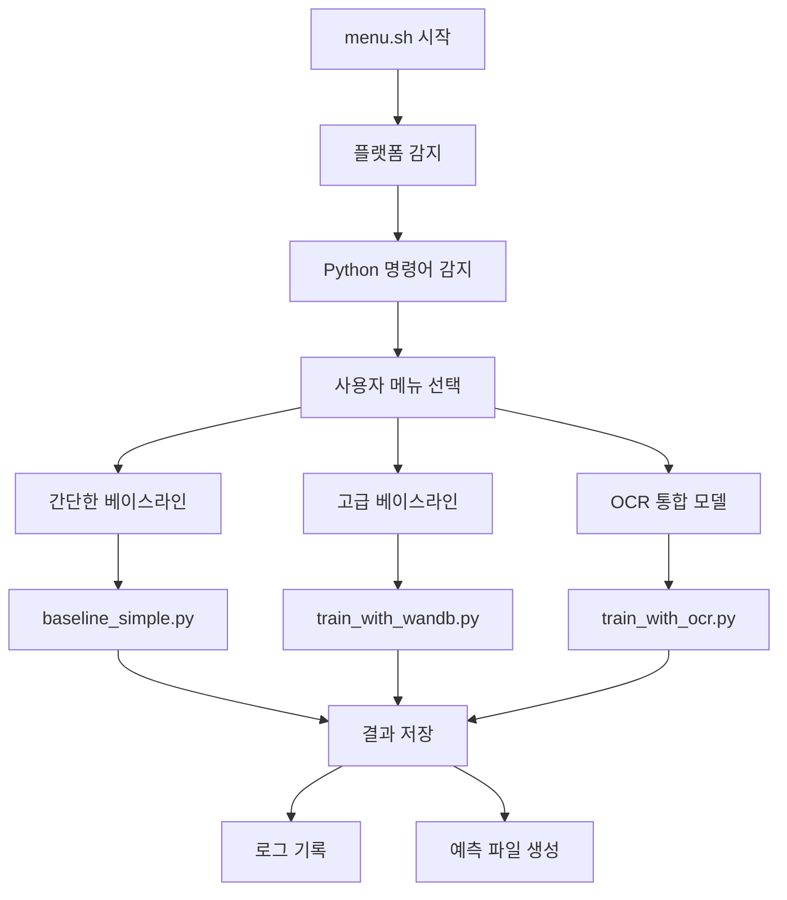
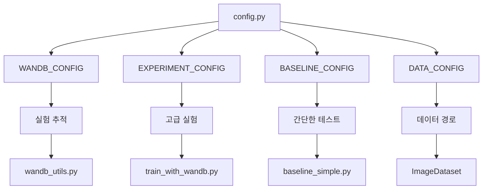
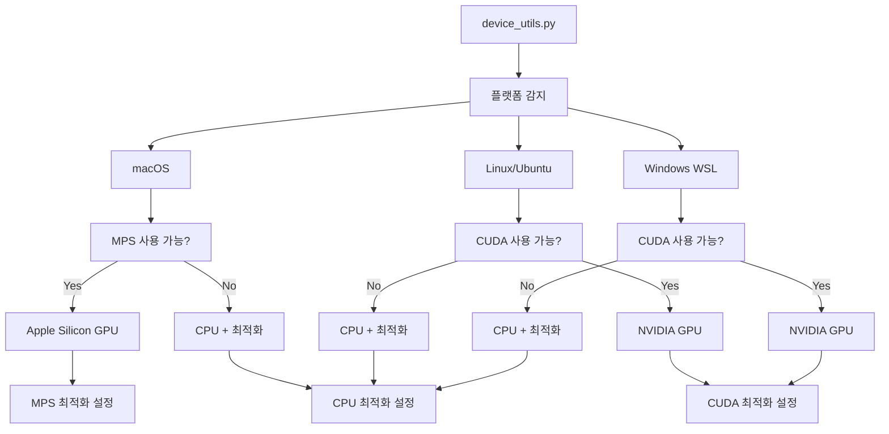

# CV-Classify 시스템 아키텍처

## 📋 개요

CV-Classify는 컴퓨터 비전 문서 분류 경진대회를 위한 통합 실행 환경입니다. 크로스 플랫폼 지원, 자동화된 실험 관리, OCR 통합 기능을 제공하는 모듈식 시스템입니다.

## 🏗️ 전체 아키텍처

```
cv-classify/
├── 🎯 Entry Point Layer
│   ├── menu.sh                    # 통합 메인 메뉴
│   └── setup.sh                   # 초기 환경 설정
│
├── 🔧 Platform Layer
│   ├── scripts/
│   │   ├── platform_utils.sh      # 크로스 플랫폼 유틸리티
│   │   ├── run_training.sh        # 학습 실행 관리
│   │   └── advanced_launcher.sh   # 고급 실행 옵션
│   └── setup_*.sh                 # 플랫폼별 설정 스크립트
│
├── 🧠 Core Python Layer
│   ├── codes/
│   │   ├── config.py              # 통합 설정 관리
│   │   ├── device_utils.py        # 디바이스 최적화
│   │   ├── wandb_utils.py         # 실험 추적 관리
│   │   ├── baseline_simple.py     # 간단한 베이스라인
│   │   ├── train_with_wandb.py    # 고급 실험 실행
│   │   └── train_with_ocr.py      # OCR 통합 모델
│   └── requirements*.txt          # 플랫폼별 의존성
│
├── 📊 Data Layer
│   ├── data/
│   │   ├── train/                 # 학습 이미지
│   │   ├── test/                  # 테스트 이미지
│   │   ├── train.csv              # 학습 라벨
│   │   └── sample_submission.csv  # 제출 형식
│   └── models/                    # 저장된 모델
│
└── 📋 Documentation Layer
    ├── docs/                      # 시스템 문서
    ├── logs/                      # 실행 로그
    └── README.md                  # 프로젝트 개요
```

## 🔄 시스템 플로우

### 1. 실행 플로우



### 2. 설정 계층 구조



### 3. 디바이스 최적화 플로우



## 🧩 주요 컴포넌트

### 1. Configuration Layer (`config.py`)

**역할**: 전체 시스템의 설정을 중앙 집중식으로 관리

**주요 기능**:
- 환경별 설정 분리 (베이스라인 vs 고급 실험)
- WandB 통합 설정
- 데이터 경로 관리
- 크로스 플랫폼 경로 처리

**설정 카테고리**:
```python
WANDB_CONFIG      # 실험 추적 설정
EXPERIMENT_CONFIG # 고급 실험 설정 (224x224, 50 epochs)
BASELINE_CONFIG   # 베이스라인 설정 (32x32, 1 epoch)
DATA_CONFIG       # 데이터 경로 및 분할 설정
LOGGING_CONFIG    # 로깅 설정
```

### 2. Device Optimization Layer (`device_utils.py`)

**역할**: 하드웨어별 최적화된 설정 제공

**크로스 플랫폼 지원**:
- **macOS**: Apple Silicon MPS 가속 지원
- **Linux/Ubuntu**: NVIDIA CUDA 지원
- **Windows WSL**: CUDA 지원 + CPU fallback
- **공통**: CPU 최적화 (멀티스레딩, 메모리 관리)

**최적화 전략**:
```python
# macOS Apple Silicon
{
    "device": "mps",
    "pin_memory": False,    # MPS는 불필요
    "num_workers": 0        # 멀티프로세싱 이슈 방지
}

# Linux/Ubuntu CUDA
{
    "device": "cuda",
    "pin_memory": True,     # GPU 메모리 최적화
    "num_workers": 4-8      # 병렬 데이터 로딩
}

# CPU Fallback
{
    "device": "cpu",
    "pin_memory": False,
    "num_workers": 2-4      # 적절한 병렬 처리
}
```

### 3. Experiment Tracking Layer (`wandb_utils.py`)

**역할**: 실험 추적 및 결과 관리

**주요 기능**:
- WandB 런 관리 (초기화, 종료)
- 메트릭 로깅 (손실, 정확도, F1 스코어)
- 모델 정보 자동 로깅
- 혼동 행렬 시각화
- 시스템 정보 로깅

**실험 관리**:
```python
# 자동 런 이름 생성
resnet34_baseline_1202_1430

# 메트릭 추적
train_loss, train_accuracy, train_f1
val_loss, val_accuracy, val_f1
learning_rate, epoch_time

# 아티팩트 관리
모델 체크포인트, 혼동 행렬, 시스템 정보
```

### 4. Execution Layer

#### 4.1 간단한 베이스라인 (`baseline_simple.py`)

**목적**: 빠른 환경 검증 및 호환성 테스트

**특징**:
- 공식 베이스라인 100% 호환
- 32x32 이미지, 1 epoch
- 30초 내 완료
- 환경 문제 디버깅용

#### 4.2 고급 실험 (`train_with_wandb.py`)

**목적**: 실제 경진대회용 실험

**특징**:
- 224x224 이미지, 50 epochs
- WandB 통합 실험 추적
- 검증 세트 분할
- 학습률 스케줄링
- 조기 종료 옵션
- 최적 모델 저장

#### 4.3 OCR 통합 (`train_with_ocr.py`)

**목적**: 문서 분류 성능 향상

**특징**:
- 이미지 + 텍스트 멀티모달
- EasyOCR/Tesseract 지원
- 텍스트 특징 추출
- 융합 분류기

### 5. Platform Layer

#### 5.1 메인 메뉴 (`menu.sh`)

**역할**: 통합 사용자 인터페이스

**기능**:
- 크로스 플랫폼 자동 감지
- 대화형 메뉴 시스템
- 백그라운드 실행 관리
- 실시간 모니터링
- 상태 확인 및 디버깅

#### 5.2 플랫폼 유틸리티 (`platform_utils.sh`)

**역할**: 플랫폼별 차이점 추상화

**기능**:
- 패키지 관리자 감지
- 파일 시간 정보 크로스 플랫폼 호환
- GPU 감지 (CUDA/MPS)
- 설치 명령어 자동 생성

## 🔗 모듈 간 상호작용

### 1. 설정 플로우

```
환경 변수 (.env) → config.py → 각 실행 스크립트
                           ↓
                    wandb_utils.py
                           ↓
                    device_utils.py
```

### 2. 실행 플로우

```
menu.sh → 스크립트 선택 → Python 스크립트
    ↓                        ↓
platform_utils.sh → config.py + device_utils.py
                              ↓
                        wandb_utils.py
                              ↓
                        모델 학습 실행
```

### 3. 데이터 플로우

```
data/ → ImageDataset → DataLoader → 모델 학습
  ↓                                    ↓
config.py                        결과 저장
  ↓                                    ↓
device_utils.py              logs/ + models/
```

## 🎯 설계 원칙

### 1. 모듈성 (Modularity)
- 각 기능별로 독립적인 모듈
- 명확한 인터페이스 정의
- 재사용 가능한 컴포넌트

### 2. 크로스 플랫폼 호환성
- 플랫폼 감지 및 자동 최적화
- 일관된 사용자 경험
- 플랫폼별 특화 기능

### 3. 확장성 (Extensibility)
- 새로운 모델 쉽게 추가
- OCR 모듈 독립적 확장
- 실험 설정 유연한 변경

### 4. 사용성 (Usability)
- 단계적 복잡도 (간단 → 고급)
- 자동화된 환경 설정
- 명확한 오류 메시지

### 5. 실험 재현성
- 시드 고정
- 설정 버전 관리
- WandB 통합 추적

## 🚀 성능 최적화

### 1. 하드웨어 최적화
- **Apple Silicon**: MPS 가속, 통합 메모리 활용
- **NVIDIA GPU**: CUDA 최적화, cuDNN 벤치마킹
- **CPU**: 멀티스레딩, 메모리 관리

### 2. 데이터 로딩 최적화
- 플랫폼별 num_workers 조정
- pin_memory 선택적 사용
- 배치 크기 자동 조정

### 3. 메모리 관리
- 그래디언트 축적 최적화
- 메모리 사용량 모니터링
- 자동 가비지 컬렉션

## 🔧 확장 가이드

### 새로운 모델 추가
1. `config.py`에 모델 설정 추가
2. `train_with_wandb.py`에서 모델 로드 부분 수정
3. WandB에서 실험 추적

### 새로운 플랫폼 지원
1. `platform_utils.sh`에 플랫폼 감지 로직 추가
2. `device_utils.py`에 디바이스 최적화 로직 추가
3. `menu.sh`에 플랫폼별 메뉴 옵션 추가

### OCR 모델 확장
1. `train_with_ocr.py`에 새로운 OCR 엔진 추가
2. 텍스트 전처리 파이프라인 확장
3. 멀티모달 융합 방법 개선

이 아키텍처는 경진대회의 요구사항을 충족하면서도 확장 가능하고 유지보수하기 쉬운 구조를 제공합니다.